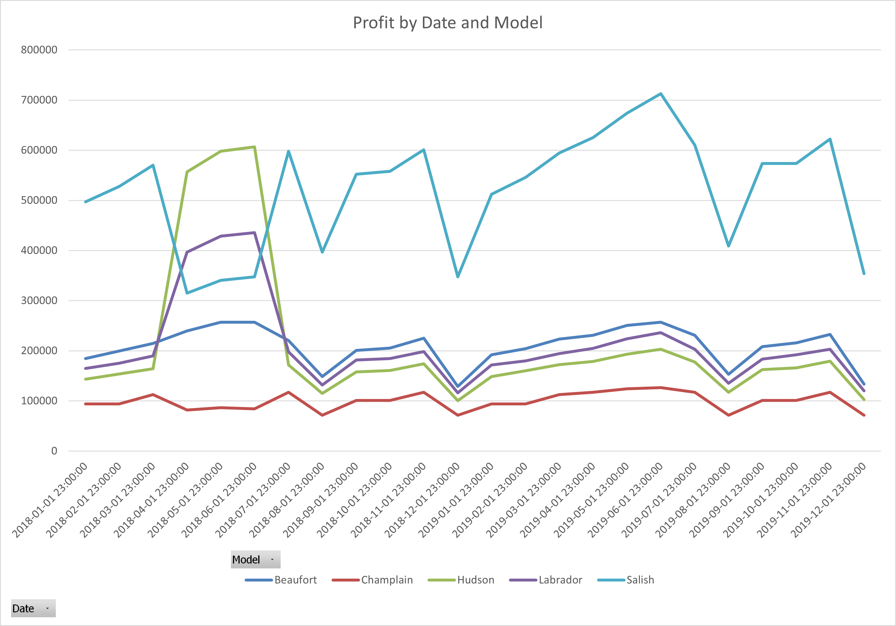
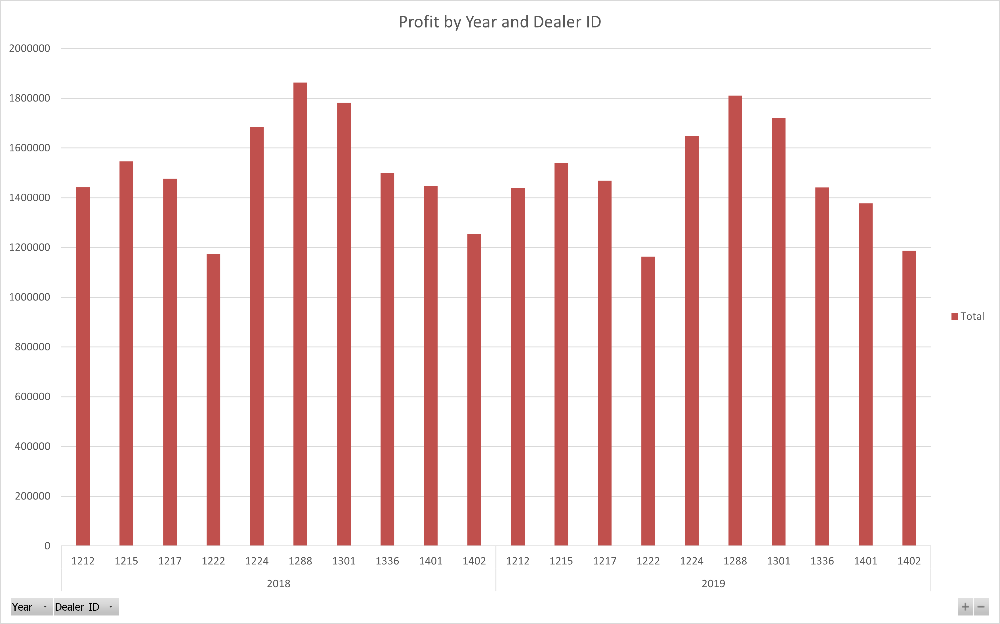
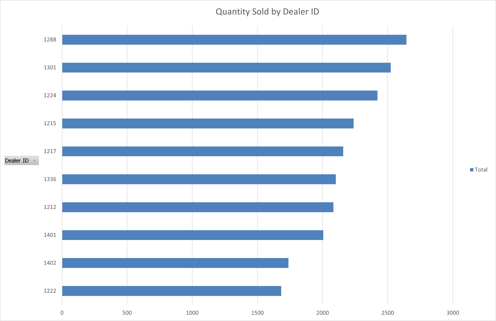
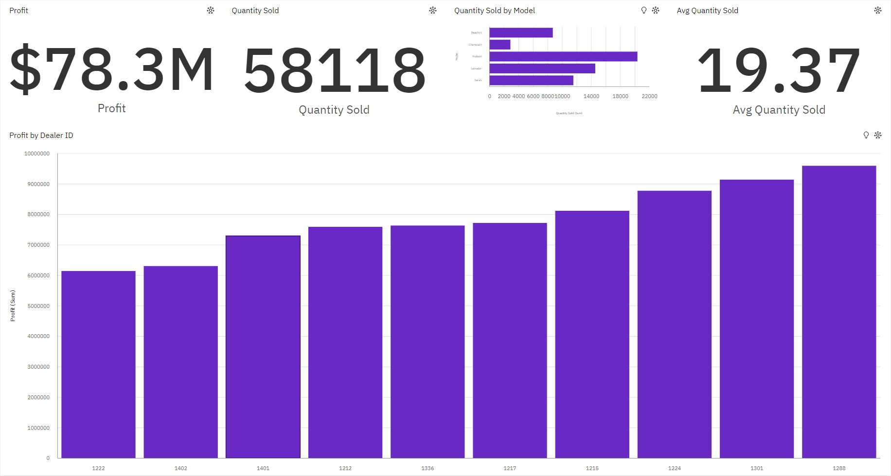
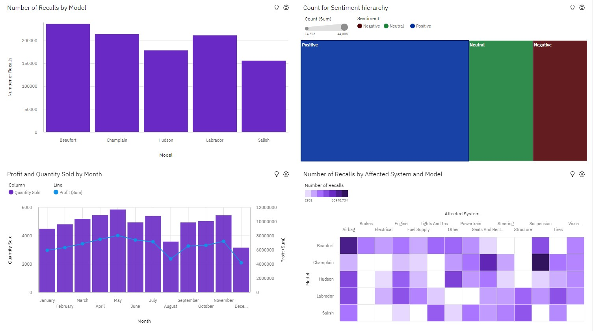

# Data Visualization and Dashboards with Excel and cognos

**Course description**: Create data visualizations and dashboards using spreadsheets and analytics tools. Using various types of charts and graphs in Excel and IBM Cognos Analytics to tell stories with data.

## Final Assignment

### 📩 Submissions

| Assignment | Submission |
| :--- | :--- |
| Part 1 | [CarSalesByModelEnd.xlsx](CarSalesByModelEnd.xlsx) |
| Part 2 | [Cognos-sales-services-dashboards.pdf](Cognos-sales-services-dashboards.pdf) |
 
### 🧰 Assignment Resources

Download the Workbook: [CarSalesByModelStart](https://cf-courses-data.s3.us.cloud-object-storage.appdomain.cloud/IBMDeveloperSkillsNetwork-DV0130EN-SkillsNetwork/Hands-on%20Labs/Peer%20Graded%20Assignment%20-%20Part%201/CarSalesByModelStart.xlsx)

---

### 🟦 Part 1: Creating Visualizations Using Excel

#### ⚫ Context

As a regional manager for a chain of car dealerships you need to create some visualizations to allow you to understand your car sales and profits for each dealer.

#### ⚫ Tasks to Perform

Create visualizations for the following:

1. **‘Quantity Sold’ by ‘Dealer ID’** - as a bar chart, sorted in either ascending or descending order of quantity sold, and change the chart title to “Quantity Sold by Dealer ID” (Hint: Use the pivot table on Sheet1, and use ‘Format’ on the ‘Chart’ tab to change the chart title)

  

2. **‘Profit’ by ‘Date’ and ‘Model’** - as a line chart, and give the chart a title of “Profit by Date and Model” (Hint: Use the pivot table on Sheet2, and use ‘Chart Title’ on the ‘Chart’ tab to change the chart title)

  

3. **‘Profit’ by ‘Year’ and ‘Dealer ID’** - as a column chart, titled “Profit by Year and Dealer ID” with the data columns in red (Hint: Use the pivot table on Sheet3, and use ‘Format’ on the ‘Chart’ tab to change the chart title and to format the ‘series’ fill color in red)

  

4. **‘Sum of Profits’ for ‘Hudson model cars’ by ‘Dealer ID’** - as a line chart, titled “Profit of Hudson Models by Dealer ID”. Also remove the horizontal gridlines from the chart, put the legend on the right side of the chart, and color the series outline in green. (Hint: Use the pivot table on Sheet4, use ‘Gridlines’ in the ‘Axes’ group on the ‘Chart’ tab to remove the gridlines, and use ‘Format’ on the ‘Chart’ tab to change the chart title, to move the legend, and to format the ‘series’ outline color in green)

  

5. **Save your workbook**: Use ‘Save As’ to save your completed workbook as CarSalesByModelEnd.xlsx

---

### 🟦 Part 2: Creating Visualizations Using Cognos Analytics

#### ⚫ Context

As a regional manager for a chain of car dealerships you need to build out a dashboard to allow you to understand your sales and service departments.

#### ⚫ Tasks to Perform

##### Create two dashboards as follows:

    * One dashboard using the tabbed template that has 4 small rectangles at the top and a large rectangle below - rename this dashboard tab to Sales.
    * One dashboard using the 2 x 2 rectangle areas tabbed template - rename this dashboard tab to Service.

##### Capture the following KPI metrics as visualizations:

1. On the Sales dashboard, capture the following KPI metrics:

    * In the first small rectangle (Panel 1), capture Profit (formatted to 1 decimal place in millions of US dollars)
    * In the second small rectangle (Panel 2), capture Quantity sold
    * In the third small rectangle (Panel 3), capture Quantity sold by model (as a bar chart)
    * In the fourth small rectangle (Panel 4), capture Average quantity sold

2. On the Sales dashboard in the large rectangle (Panel 5), display ‘Profit’ by ‘Dealer ID’ as a column chart, sorted in ascending order.

3. On the Service dashboard, capture the following KPI metrics as visualizations:

    * In the top left area (Panel 1), capture the number of recalls per model of car (as a column chart)
    * In the top right area (Panel 2), capture the customer sentiment by comparing positive, neutral, and negative reviews (as a treemap)
    * In the bottom left area (Panel 3), capture the quantity of cars sold per month compared to the profit (as a line and column chart).
    * In the bottom right area (Panel 4), capture the number of recalls by model and affected system (as a heat map). This will help us understand if there are any outliers for a given model or a specific system.
    
4. To export your dashboard as a PDF

#### ⚫ Dashboards

<h2>
<b>Sales</b>
</h2>

  

<h2>
<b>Services</b>
</h2>

  

