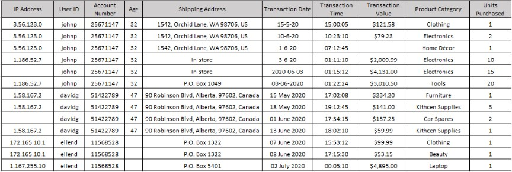
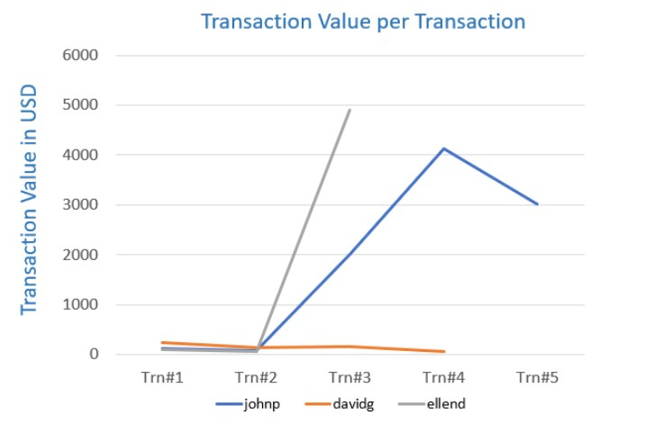

# Data Analysis in Action

## Introduction

Companies today are employing analytical techniques for the early detection of credit card frauds, a key factor in mitigating fraud damage. The most common type of credit card fraud does not involve the physical stealing of the card, but that of credit card credentials, which are then used for online purchases.

Imagine that you have been hired as a Data Analyst to work in the Credit Card Division of a bank. And your first assignment is to join your team in using data analysis for the early detection and mitigation of credit card fraud.   

#### Sample data set of credit card transaction details for a few users

---

#### Sample data visualization chart of data set

---

## Questions

### 1. List at least 5 (five) data points that are required for the analysis and detection of a credit card fraud. 

### 2. Identify 3 (three) errors/issues that could impact the accuracy of your findings, based on a data table provided. 

### 3. Identify 2 (two) anomalies, or unexpected behaviors, that would lead you to believe the transaction may be suspect, based on a data table provided. 

### 4. Briefly explain your key take-away from the provided data visualization chart. 

### 5. Identify the type of analysis that you are performing when you are analyzing historical credit card data to understand what a fraudulent transaction looks like. [Hint: The four types of Analytics include: Descriptive, Diagnostic, Predictive, Prescriptive]  

