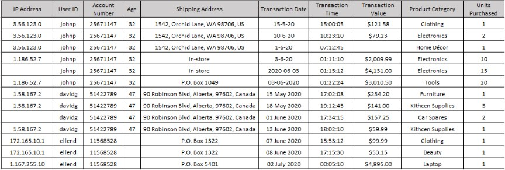
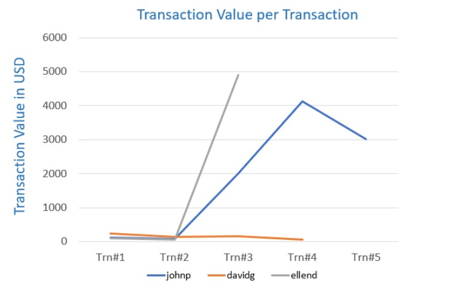

# Introduction to Data Analytics

**Course description**: Highlighting the role of a data analyst, and the tools used in the job. This includes the skills and responsibilities of a data analyst and the differences between Data Analysts, Data Scientists, and Data Engineers.

# Final Assignment

## Data Analysis in Action

### Introduction

Companies today are employing analytical techniques for the early detection of credit card frauds, a key factor in mitigating fraud damage. The most common type of credit card fraud does not involve the physical stealing of the card, but that of credit card credentials, which are then used for online purchases.

Imagine that you have been hired as a Data Analyst to work in the Credit Card Division of a bank. And your first assignment is to join your team in using data analysis for the early detection and mitigation of credit card fraud.   

### Sample data set of credit card transaction details for a few users

.

---

### Sample data visualization chart of data set

.

---

### Questions

#### 1. List at least 5 (five) data points that are required for the analysis and detection of a credit card fraud. 

**Ans**: 

  * The identification details of the customer or card holder 

  * The date and time transactions took place

  * The amount spent on each transaction

  * The address to which said transaction goods were delivered

  * The IP address from which the transaction was made

#### 2. Identify 3 (three) errors/issues that could impact the accuracy of your findings, based on a data table provided. 

**Ans**: 

  * Missing data for the transaction value for user ID "johnp"

  * Missing ip address for the user ID's "johnp" and "davidg"

  * Variations in date format

#### 3. Identify 2 (two) anomalies, or unexpected behaviors, that would lead you to believe the transaction may be suspect, based on a data table provided. 

**Ans**: 

  * There are changes in ip address for the user ID's "johnp" and "ellend"

  * There are changes in shipping address for user ID's "johnp" and "ellend"

#### 4. Briefly explain your key take-away from the provided data visualization chart. 

**Ans**: The visual details the amount of the transactions and the number of transactions for the specific user ID's. The most significant detail is the sudden increase in the amount per transaction for the user ID's "johnp" and "ellend". This may indicate fraudulent activity.

#### 5. Identify the type of analysis that you are performing when you are analyzing historical credit card data to understand what a fraudulent transaction looks like. [Hint: The four types of Analytics include: Descriptive, Diagnostic, Predictive, Prescriptive]  

**Ans**: Descriptive analytics

