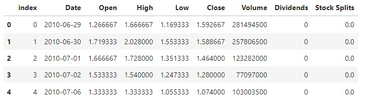
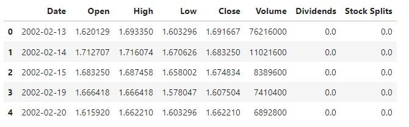
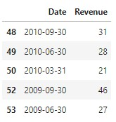
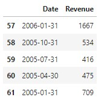
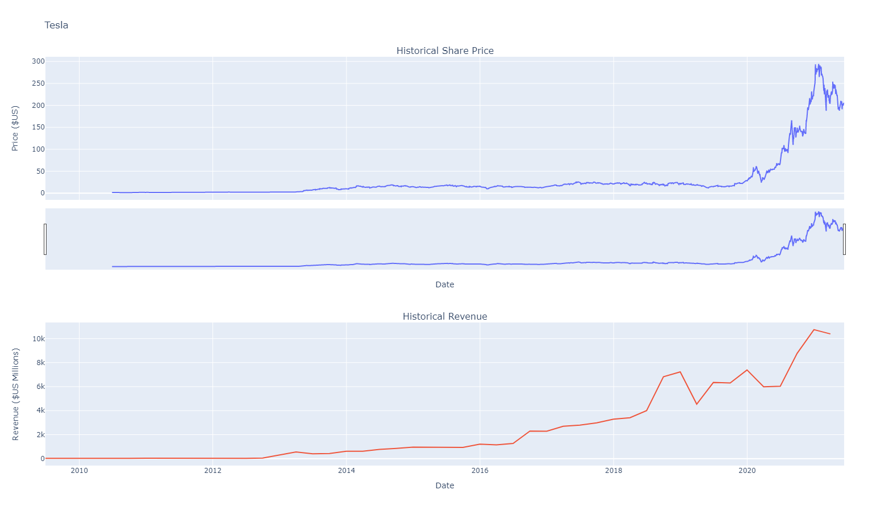
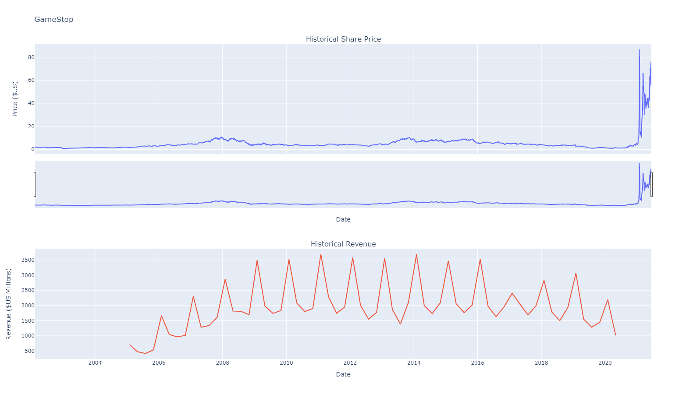

# Python Project for Data Science

**Course description**: In this mini-course you will be assuming the role of a Data Scientist / Data Analyst. In this role you will be given a scenario and data to begin your Python project. During this process you will perform specific tasks such as extracting data, web scraping, visualizing data, and creating a dashboard.

---

## 💼 Project Overview: [An Analysis of Tesla and GameStop Stock Data](ibm-project-notebook.ipynb)

### 🧰 Materials

* [Completed IBM Lab Jupyter Notebook](ibm-project-notebook.ipynb)
* [Tesla Revenue Data by IBM](https://cf-courses-data.s3.us.cloud-object-storage.appdomain.cloud/IBMDeveloperSkillsNetwork-PY0220EN-SkillsNetwork/labs/project/revenue.htm)
* [GameStop Revenue Data by IBM](https://cf-courses-data.s3.us.cloud-object-storage.appdomain.cloud/IBMDeveloperSkillsNetwork-PY0220EN-SkillsNetwork/labs/project/stock.html)
* [Visualizations](images/)

### 🟦 Introduction

For this project, you will assume the role of a Data Scientist / Data Analyst working for a new startup investment firm that helps customers invest their money in stocks. Your job is to extract financial data like historical share price and quarterly revenue reportings from various sources using Python libraries and webscraping on popular stocks. After collecting this data you will visualize it in a dashboard to identify patterns or trends. The stocks we will work with are Tesla, Amazon, AMD, and GameStop.

#### ⚪ Useful Word Definitions:

  * **Stock**: a security that represents the ownership of a fraction of a corporation
  * **Shares**: a unit of stock
  * **Investor**: someone who buys and sells stocks for profit
  * **Stock ticker**: a report of the price of a certain stock

---

### 🟦 Part 1: Extracting Stock Data Using yfinance

#### ⚪ 1. Import the necessary libraries and modules
```
import yfinance as yf
import pandas as pd
import plotly.graph_objects as go
import requests
from bs4 import BeautifulSoup
from plotly.subplots import make_subplots
```

#### ⚪ 2. Create yfinance ticker objects for Tesla and GameStop stocks
```
tesla = yf.Ticker("TSLA")

gamestop = yf.Ticker("GME")
```

#### ⚪ 3. Extract the stock information and save it as a dataframe 
```
tesla_data = tesla.history(period="max")

gamestop_data = gamestop.history(period="max")
```

#### ⚪ 4. Reset the index of both dataframes and display the first five rows
```
tesla_data.reset_index(inplace=True)

gamestop_data.reset_index(inplace=True)
```

  * Display first five rows of **tesla_data** DataFrame
```
tesla_data.head(5)
```


  * Display first five rows of **gamestop_data** DataFrame
```
gamestop_data.head(5)
```


---

### 🟦 Part 2: Extracting Revenue Data Using Webscraping

#### ⚪ 1. Tesla Revenue Data

* Use the requests library to download the data source webpage and save it as text in a variable
```
url = "https://cf-courses-data.s3.us.cloud-object-storage.appdomain.cloud/IBMDeveloperSkillsNetwork-PY0220EN-SkillsNetwork/labs/project/revenue.htm"

html_data = requests.get(url).text
```

* Parse the data using beautiful_soup
```
soup = BeautifulSoup(html_data, "html.parser")
```

* Using BeautifulSoup extract the table with Tesla Quarterly Revenue and store it into a dataframe with columns 'Date' and 'Revenue'
```
tesla_revenue = pd.DataFrame(columns = ["Date","Revenue"])

for table in soup.find_all('table'):
    if table.find('th').getText().startswith("Tesla Quarterly Revenue"):
        for row in table.find("tbody").find_all("tr"):
            col = row.find_all("td")
            if len(col) != 2: continue
            Date = col[0].text
            Revenue = col[1].text
               
            tesla_revenue = tesla_revenue.append({"Date":Date, "Revenue":Revenue}, ignore_index=True)
```

* Remove the comma and dollar sign from the Revenue column*
```
tesla_revenue["Revenue"] = tesla_revenue['Revenue'].str.replace(',|\$',"")
```


* Remove any null or empty strings from the Revenue column
```
tesla_revenue.dropna(inplace=True)

tesla_revenue = tesla_revenue[tesla_revenue['Revenue'] != ""]
```

* Display the last five rows of **tesla_revenue** DataFrame
```
tesla_revenue.tail(5)
```


#### ⚪ 1. GameStop Revenue Data

* Use the requests library to download the data source webpage and save it as text in a variable
```
url = "https://cf-courses-data.s3.us.cloud-object-storage.appdomain.cloud/IBMDeveloperSkillsNetwork-PY0220EN-SkillsNetwork/labs/project/stock.html"

html_data = requests.get(url).text
```

* Parse the data using beautiful_soup
```
soup = BeautifulSoup(html_data, "html.parser")
```

* Using BeautifulSoup extract the table with Tesla Quarterly Revenue and store it into a dataframe with columns 'Date' and 'Revenue'
```
gme_revenue = pd.DataFrame(columns = ["Date","Revenue"])

for table in soup.find_all('table'):
    if table.find('th').getText().startswith("GameStop Quarterly Revenue"):
        for row in table.find("tbody").find_all("tr"):
            col = row.find_all("td")
            if len(col) != 2: continue
            Date = col[0].text
            Revenue = col[1].text
               
            gme_revenue = gme_revenue.append({"Date":Date, "Revenue":Revenue}, ignore_index=True)
```

* Remove the comma and dollar sign from the Revenue column*
```
gme_revenue["Revenue"] = gme_revenue['Revenue'].str.replace(',|\$',"")
```


* Remove any null or empty strings from the Revenue column
```
gme_revenue.dropna(inplace=True)

gme_revenue = gme_revenue[gme_revenue['Revenue'] != ""]
```

* Display the last five rows of **tesla_revenue** DataFrame
```
gme_revenue.tail(5)
```


---

### 🟦 Part 3: Plotting The Stock Graphs 

#### ⚪ 1. Defining A Graphing Function

* Define a graphing function **make_graph** that takes three parameters; one for the stock data, another for the revenue data and one more for the name of the stock.
```
def make_graph(stock_data, revenue_data, stock):
    fig = make_subplots(rows=2, cols=1, shared_xaxes=True, subplot_titles=("Historical Share Price", "Historical Revenue"), vertical_spacing = .3)
    stock_data_specific = stock_data[stock_data.Date <= '2021--06-14']
    revenue_data_specific = revenue_data[revenue_data.Date <= '2021-04-30']
    fig.add_trace(go.Scatter(x=pd.to_datetime(stock_data_specific.Date, infer_datetime_format=True), y=stock_data_specific.Close.astype("float"), name="Share Price"), row=1, col=1)
    fig.add_trace(go.Scatter(x=pd.to_datetime(revenue_data_specific.Date, infer_datetime_format=True), y=revenue_data_specific.Revenue.astype("float"), name="Revenue"), row=2, col=1)
    fig.update_xaxes(title_text="Date", row=1, col=1)
    fig.update_xaxes(title_text="Date", row=2, col=1)
    fig.update_yaxes(title_text="Price ($US)", row=1, col=1)
    fig.update_yaxes(title_text="Revenue ($US Millions)", row=2, col=1)
    fig.update_layout(showlegend=False,
    height=900,
    title=stock,
    xaxis_rangeslider_visible=True)
    fig.show()
```

#### ⚪ 2. Tesla's Stock Graph
```
make_graph(tesla_data, tesla_revenue, 'Tesla')
```


#### ⚪ 3. GameStop's Stock Graph
```
make_graph(gme_data, gme_revenue, 'GameStop')
```

