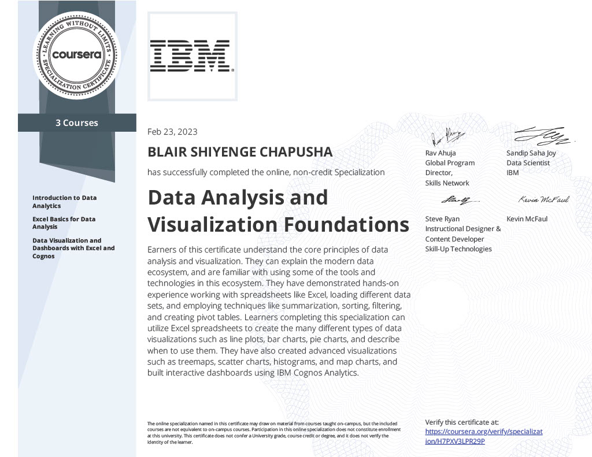

# IBM Data Analyst Professional Certificate
## About

This respository contains all the courses with solutions to quizzes and lab work, in the 2023 **IBM Data Analyst Professional Certificate** featured on Cousera. Under this readme, is detailed a brief description of what each course entails along with the accompanying certificate.

## Professional Certificate

---

## Certificate Courses

### 1. Data Analysis and Visualization Foundations (3-in-1 Course)

#### 1.1 Introduction to Data Analytics

**Course description:** 

Highlighting the role of a data analyst, and the tools used in the job. This includes the skills and responsibilities of a data analyst and the differences between Data Analysts, Data Scientists, and Data Engineers.

**Skills acquired:**

<table>
    <tr>
        <td>Data Analysis</td><td>Data Visualization</td>
    </tr>
</table>

#### 1.2 Excel Basics for Data Analysis

**Course description:** 

Introduction to spreadsheets including Excel and Google Sheets. Collecting, wrangling and cleaning data using functions and analyzing data through filtering, sorting and pivot tables

**Skills acquired:**

<table>
    <tr>
        <td>Microsoft Excel</td><td>Pivot Tables</td><td>Spreadsheets</td><td>DAX</td>
    </tr>
</table>

#### 1.3 Data Visualization and Dashboards with Excel and Cognos

**Course description:** 

Create data visualizations and dashboards using spreadsheets and analytics tools. Using various types of charts and graphs in Excel and IBM Cognos Analytics to tell stories with data.

**Skills acquired:**

<table>
    <tr>
        <td>IBM Cosgnos Analytics</td><td>Dashboard</td><td>Microsoft Excel</td>
    </tr>
</table>

#### Certificate:

---
