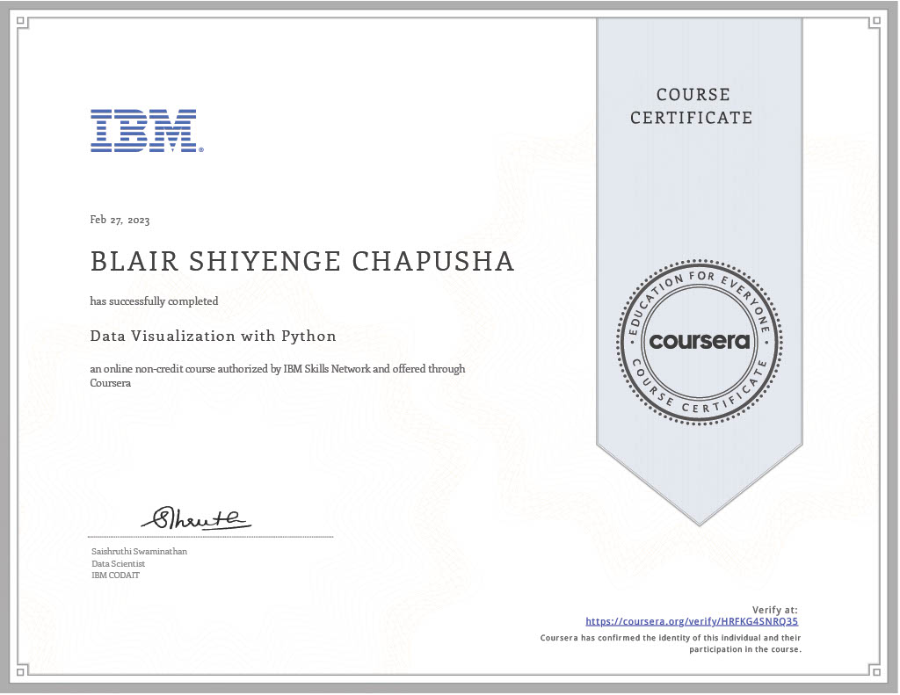
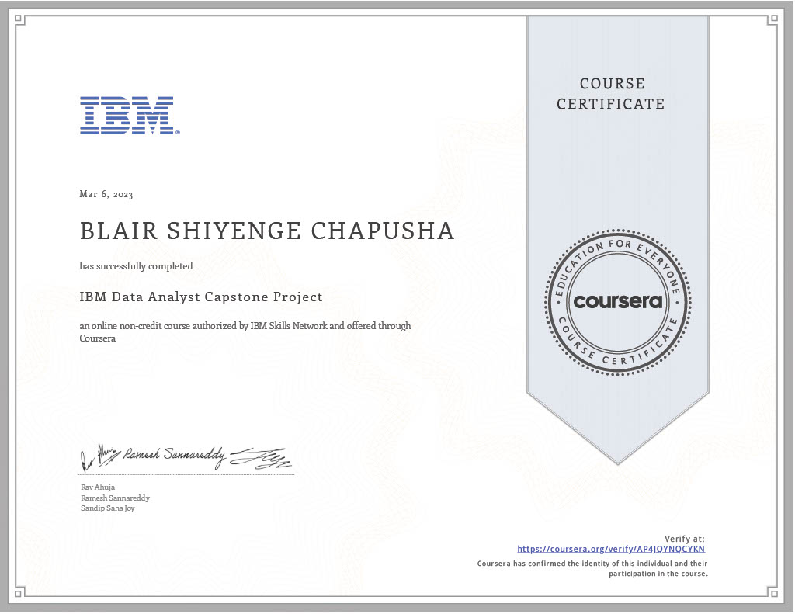

# IBM Data Analyst Professional Certificate      

## About

This respository contains all the courses with solutions to quizzes and lab work, in the 2023 [**IBM Data Analyst Professional Certificate**](https://www.coursera.org/professional-certificates/ibm-data-analyst?) featured on Cousera. Under this readme, is a brief description of what each course entails along with the accompanying certificate.

## Professional Certificate

---

## Certificate Courses

### Data Analysis and Visualization Foundations (3-in-1 Certificate)

#### 1. [Introduction to Data Analytics](https://github.com/bchapusha/IBM-Data-Analyst-Professional-Certificate/tree/main/Introduction-to-data-analytics)

##### Course description

Highlighting the role of a data analyst, and the tools used in the job. This includes the skills and responsibilities of a data analyst and the differences between Data Analysts, Data Scientists, and Data Engineers.

##### Skills acquired

<table>
    <tr>
        <td>Data Analysis</td><td>Data Science</td><td>Data Visualization</td>
    </tr>
</table>

#### 2. [Excel Basics for Data Analysis](https://github.com/bchapusha/IBM-Data-Analyst-Professional-Certificate/tree/main/Excel-basics-for-data-anaysis)

##### Course description

Introduction to spreadsheets including Excel and Google Sheets. Collecting, wrangling and cleaning data using functions and analyzing data through filtering, sorting and pivot tables

##### Skills acquired

<table>
    <tr>
        <td>Microsoft Excel</td><td>Pivot Tables</td><td>Spreadsheets</td>
    </tr>
</table>

#### 3. [Data Visualization and Dashboards with Excel and Cognos](https://github.com/bchapusha/IBM-Data-Analyst-Professional-Certificate/tree/main/Data-visualization-and-dashboards-with-excel-and-cognos)

##### Course description

Create data visualizations and dashboards using spreadsheets and analytics tools. Using various types of charts and graphs in Excel and IBM Cognos Analytics to tell stories with data.

##### Skills acquired

<table>
    <tr>
        <td>IBM Cosgnos Analytics</td><td>Dashboard</td><td>Microsoft Excel</td>
    </tr>
</table>

#### Certificate

---

### 4. [Python for Data Science and AI Development](https://github.com/bchapusha/IBM-Data-Analyst-Professional-Certificate/tree/main/Python-for-data-science-ai-and-development)

#### Course description

Introduction to the basics of Python programming. Dealing with syntax, data structures and logic concepts; using Pandas, Numpy and Beautiful Soup libaries. Applying these skills to create programs and work in labs using Jupyter Notebooks.

#### Skills acquired

<table>
    <tr>
        <td>Python Programming</td><td>Pandas</td><td>Numpy</td>
    </tr>
</table>

#### Certificate

---
### 5. [Python Project for Data Science](https://github.com/bchapusha/IBM-Data-Analyst-Professional-Certificate/tree/main/Python-project-for-data-science)

#### Course description 

A demonstration of skills aquired in the *Python for Data Science and AI Development* course; assuming the role of a Data Analyst and be provided with a real-world data set and a real-world inspired scenario to identify patterns and trends.

#### Project Summary
    
|**Project Name** | **Description** |
|:--- | :--- |
| [An Analysis of Tesla and Gamestop Stock Data](https://github.com/bchapusha/IBM-Data-Analyst-Professional-Certificate/tree/main/Python-project-for-data-science) | A new startup investment firm helps customers invest their money in stocks. Extract financial data like historical share price and quarterly revenue reportings from various sources using Python libraries and webscraping on popular stocks. Visualize it in a dashboard to identify patterns or trends. |

#### Skills acquired

<table>
    <tr>
        <td>Python Programming</td><td>Pandas</td><td>Jupyter Notebooks</td>
    </tr>
</table>

#### Certificate

---

### 6. [Databases and SQL for Data Science with Python](https://github.com/bchapusha/IBM-Data-Analyst-Professional-Certificate/tree/main/Databases-and-sql-for-data-science-with-python)

#### Course description

Introduction to SQL for data analysis and using SQL with Python. Building queries and working with real databases on the IBM cloud to analyze and draw data-driven conclusions. 

#### Skills acquired

<table>
    <tr>
        <td>Relational Database Management System (RDBMS)</td><td>SQL</td><td>Cloud Databases</td>
    </tr>
</table>

#### Certificate

---

### 7. [Data Analysis with Python](https://github.com/bchapusha/IBM-Data-Analyst-Professional-Certificate/tree/main/Data-analysis-with-python)

#### Course description

Building and evualuating data models using Python. Importing data, cleaning and wrangling data, performing exploratory data analysis and creating meaninful data visualizations. Predicting trends by developing linear, multiple, polynomial regression models and pipelines.

#### Skills acquired

<table>
    <tr>
        <td>Python Programming</td><td>Predictive Modelling</td><td>Model Selection</td>
    </tr>
</table>

#### Certificate

---

### 8. [Data Visualization with Python](https://github.com/bchapusha/IBM-Data-Analyst-Professional-Certificate/tree/main/Data-visualization-with-python)

#### Course description

Work with various data visualization tools and techniques; creating basic and advanced graphs and charts. Creating interactive dashboards and completing a final project to apply the skills learned. 

#### Project Summary
    
|**Project Name** | **Description** |
|:--- | :--- |
| [An Analysis of Tesla and Gamestop Stock Data](https://github.com/bchapusha/IBM-Data-Analyst-Professional-Certificate/tree/main/Python-project-for-data-science) | A new startup investment firm helps customers invest their money in stocks. Extract financial data like historical share price and quarterly revenue reportings from various sources using Python libraries and webscraping on popular stocks. Visualize it in a dashboard to identify patterns or trends. |

#### Skills acquired

<table>
    <tr>
        <td>Python Programming</td><td>Matplotlib</td><td>Seaborn</td>
    </tr>
</table>

#### Certificate

---

### 9. [IBM Data Analyst Capstone Project](https://github.com/bchapusha/IBM-Data-Analyst-Professional-Certificate/tree/main/Data-analysis-with-python)

#### Course description

Applying the various data analytics skills and techniques learned in previous courses of the IBM Data Analyst Professional Certificate in a detailed project. Culminating with a presentation of a data analysis report for various stakeholders in a select organization. The report includes an executive summary, the details of the analysis, and a conclusion. 

#### Project Summary
    
|**Project Name** | **Description** |
|:--- | :--- |
| [An Analysis of Tesla and Gamestop Stock Data](https://github.com/bchapusha/IBM-Data-Analyst-Professional-Certificate/tree/main/Python-project-for-data-science) | A new startup investment firm helps customers invest their money in stocks. Extract financial data like historical share price and quarterly revenue reportings from various sources using Python libraries and webscraping on popular stocks. Visualize it in a dashboard to identify patterns or trends. |

#### Skills acquired

<table>
    <tr>
        <td>Python Programming</td><td>SQL and RDBMS</td><td>Data Analysis</td>
    </tr>
</table>

#### Certificate

