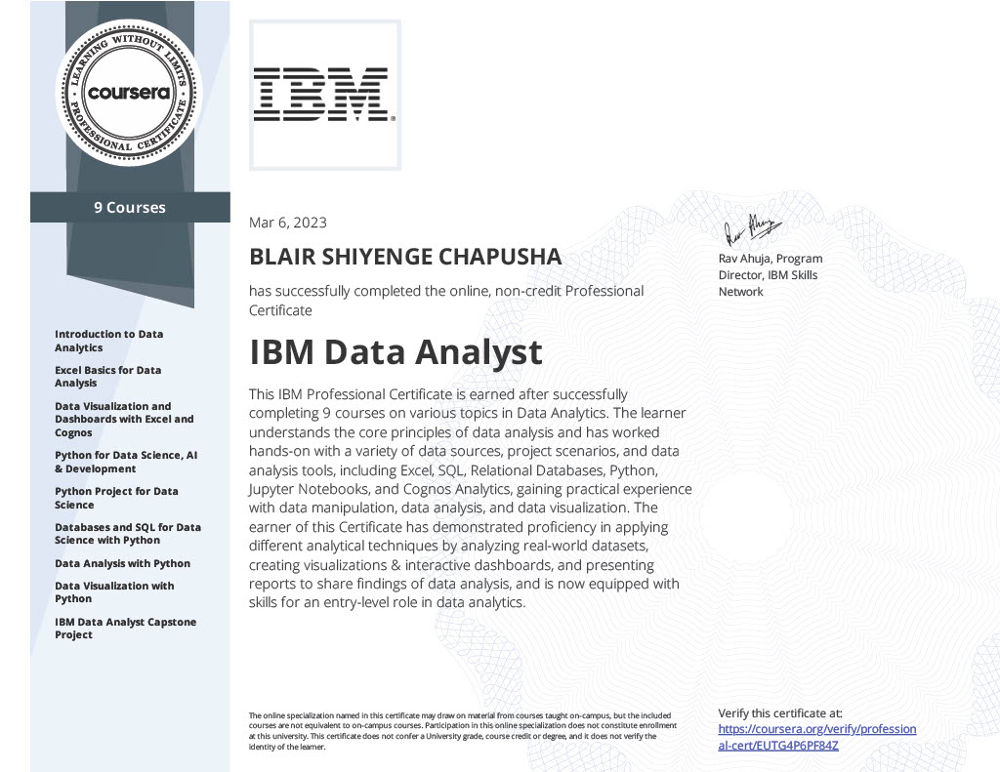
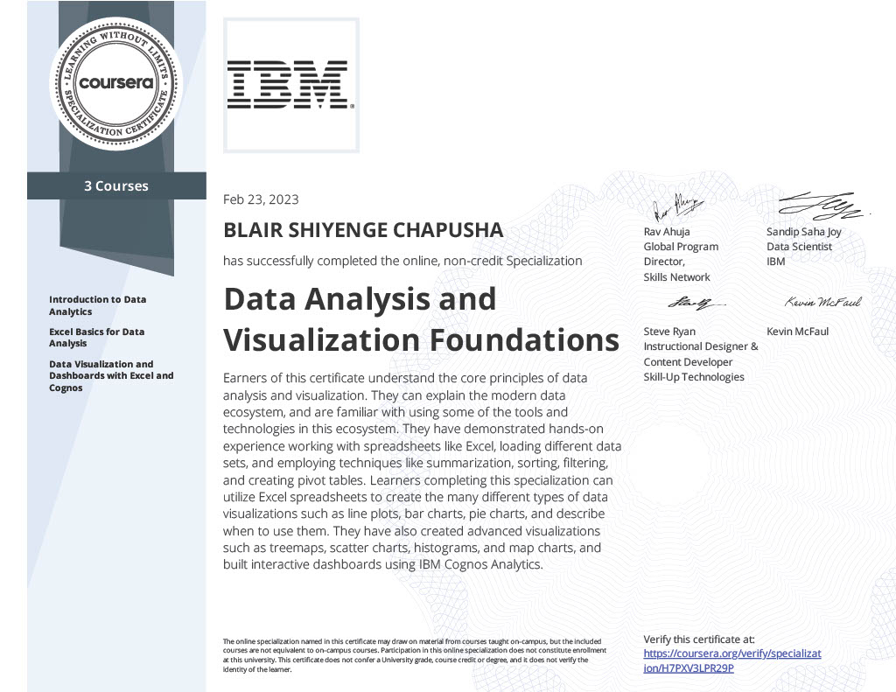

# IBM Data Analyst Professional Certificate
## About

This respository contains all the courses with solutions to quizzes and lab work, in the 2023 **IBM Data Analyst Professional Certificate** featured on Cousera. Under this readme, is detailed a brief description of what each course entails along with the accompanying certificate.

## Professional Certificate

## Contents

| Courses |
| :---        |
| 1. Introduction to Data Analytics      | 

## Certificate Courses

### 1. Introduction to Data Analytics

**Course description**: Highlighting the role of a data analyst, and the tools used in the job. This includes the skills and responsibilities of a data analyst and the differences between Data Analysts, Data Scientists, and Data Engineers.

**Skills acquired**

<table>
    <tr>
        <td>Data Analysis</td><td>Data Visualization<td>Spreadsheets</td>
    </tr>
</table>

**Course Certificate**:

### 2. Excel Basics for Data Analysis

**Course description** 

Highlighting the role of a Data Analyst, and the tools used in this job. This includes the skills and responsibilities of a data analyst and the differences between Data Analysts, Data Scientists, and Data Engineers.

**Skills acquired**

<table>
    <tr>
        <td>Data Analysis</td><td>Data Visualization<td>Spreadsheets</td>
    </tr>
</table>

**Course Certificate**

